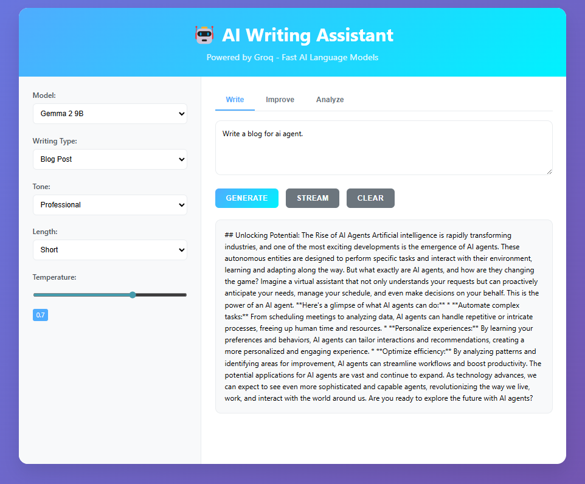
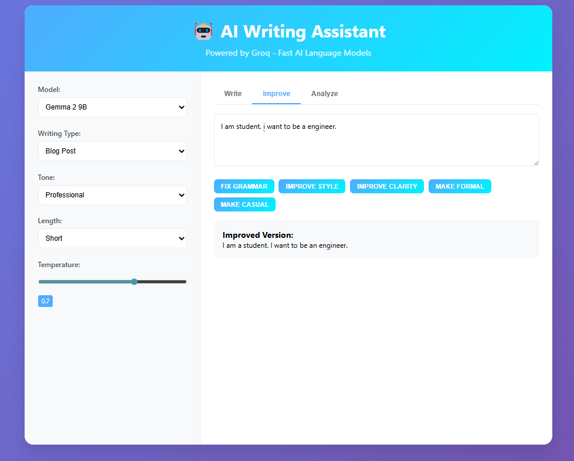
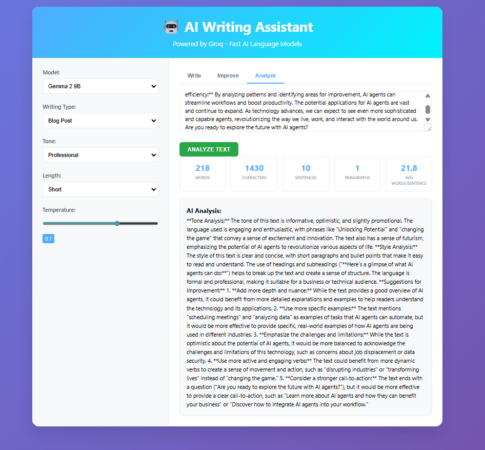

# AI Writing Assistant

A powerful AI Writing Assistant built with Flask and Groq API, featuring real-time streaming responses and multiple writing modes.

## Features




### 🚀 **Fast AI Models**
- Powered by Groq's lightning-fast inference
- Multiple model options (Llama 3.1, Gemma 2, Mixtral)
- Real-time streaming responses

### ✍️ **Writing Modes**
- **Creative Writing**: Stories, poems, creative content
- **Blog Posts**: Professional blog content
- **Email**: Professional email composition
- **Essays**: Academic and formal essays
- **Summary**: Text summarization
- **Rewrite**: Content improvement
- **Grammar**: Grammar and spelling correction
- **Translation**: Language translation
- **Outline**: Content outlines
- **Ideas**: Brainstorming and ideation

### 🎛️ **Customization Options**
- **Tone Control**: Professional, Casual, Formal, Creative, Persuasive, Informative
- **Length Control**: Short, Medium, Long
- **Temperature**: Creativity level adjustment (0.1-1.0)
- **Model Selection**: Choose from available Groq models

### 🛠️ **Advanced Features**
- **Streaming Mode**: See text generate in real-time
- **Text Improvement**: Grammar fixing, style enhancement, clarity improvement
- **Text Analysis**: Word count, readability metrics, AI-powered analysis
- **Responsive Design**: Works on desktop and mobile
- **Keyboard Shortcuts**: Ctrl+Enter to generate, Ctrl+L to clear

## Setup Instructions

### 1. Clone the Repository
```bash
git clone <repository-url>
cd ai-writing-assistant
```

### 2. Install Dependencies
```bash
pip install -r requirements.txt
```

### 3. Set Up Groq API Key
The API key is already included in the code for demonstration purposes. For production use, it's recommended to use environment variables:

```bash
# Create a .env file
echo "GROQ_API_KEY=your_api_key_here" > .env
```

Then update the code to use:
```python
import os
from dotenv import load_dotenv

load_dotenv()
client = Groq(api_key=os.getenv("GROQ_API_KEY"))
```

### 4. Run the Application
```bash
python app.py
```

The application will be available at `http://localhost:5000`

## Project Structure

```
ai-writing-assistant/
├── ai_writing_assistant.py                 # Main Flask application
├── templates/
│   └── index.html  # Frontend template
├── requirements.txt       # Python dependencies
├── .env                   # Environment variables (optional)
└── README.md             # This file
```

## API Endpoints

### `/api/generate` (POST)
Generate text without streaming
```json
{
  "input": "Your prompt here",
  "model": "llama-3.1-8b-instant",
  "type": "creative",
  "tone": "professional",
  "length": "medium",
  "temperature": 0.7
}
```

### `/api/generate_stream` (POST)
Generate text with streaming
- Same parameters as `/api/generate`
- Returns Server-Sent Events stream

### `/api/improve` (POST)
Improve existing text
```json
{
  "text": "Text to improve",
  "type": "grammar",
  "model": "llama-3.1-8b-instant"
}
```

### `/api/analyze` (POST)
Analyze text metrics
```json
{
  "text": "Text to analyze"
}
```

## Usage Examples

### 1. Creative Writing
- Select "Creative Writing" mode
- Set tone to "Creative"
- Enter prompt: "A mysterious door appears in the forest"
- Click "Stream" for real-time generation

### 2. Professional Email
- Select "Email" mode
- Set tone to "Professional"
- Enter prompt: "Request for project deadline extension"
- Adjust temperature to 0.3 for more formal output

### 3. Blog Post
- Select "Blog Post" mode
- Set tone to "Informative"
- Set length to "Long"
- Enter topic: "Benefits of AI in healthcare"

### 4. Text Improvement
- Switch to "Improve" tab
- Paste your text
- Click "Fix Grammar" or "Improve Style"

### 5. Text Analysis
- Switch to "Analyze" tab
- Paste your text
- Click "Analyze Text" for metrics and AI feedback

## Customization

### Adding New Models
Update the `MODELS` dictionary in `app.py`:
```python
MODELS = {
    "new-model-id": "Display Name",
    # ... existing models
}
```

### Adding New Writing Types
Update the `WRITING_PROMPTS` dictionary:
```python
WRITING_PROMPTS = {
    "new_type": "Your prompt template: ",
    # ... existing prompts
}
```

### Styling
The application uses modern CSS with:
- Gradient backgrounds
- Responsive grid layout
- Smooth animations
- Mobile-friendly design

## Security Notes

- The API key is currently hardcoded for demonstration
- For production, use environment variables
- Consider rate limiting for public deployments
- Implement proper error handling and logging

## Contributing

1. Fork the repository
2. Create a feature branch
3. Make your changes
4. Test thoroughly
5. Submit a pull request

## License

This project is open source and available under the [MIT License](LICENSE).

## Support

For questions or issues:
1. Check the existing issues
2. Create a new issue with detailed description
3. Include error messages and steps to reproduce

---

**Happy Writing! 🚀**